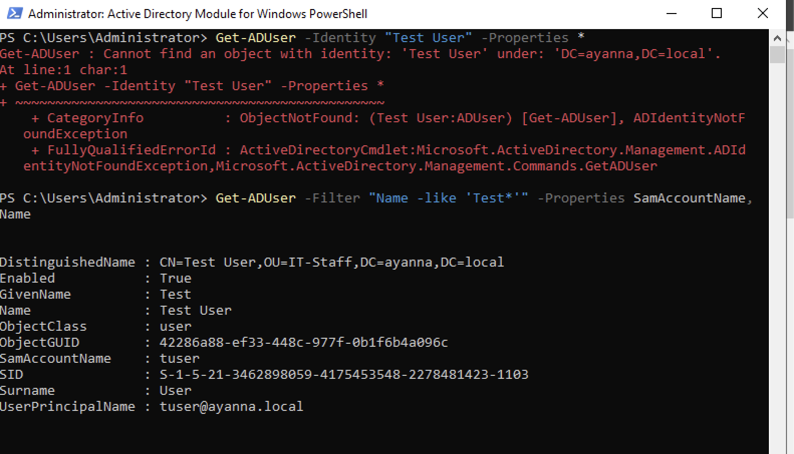
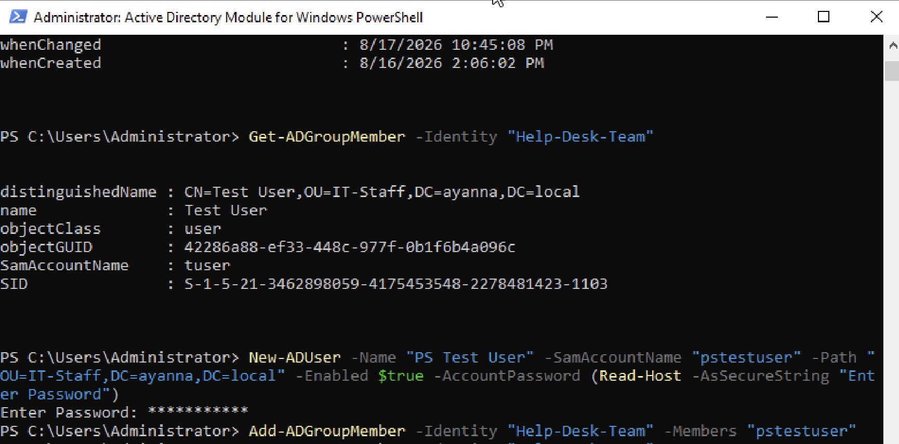
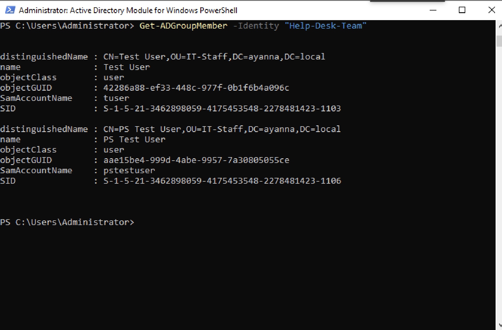

# Windows Active Directory Home Lab

## Overview
This project is a self-built Windows Server Active Directory environment, created as hands-on practice to reinforce CompTIA Network+ and Security+ concepts and to build practical IAM/identity administration skills beyond day-to-day help desk work.

The lab was built from scratch on a MacBook (Apple Silicon) using UTM for virtualization, running Windows Server 2022 (Evaluation) as the domain controller.

## Why I Built This
I work in a customer service role handling password resets, MFA, and IAM support, and wanted to go deeper — understanding and administering the systems behind those processes rather than just the front-line tickets. This lab lets me practice the concepts I'm studying for Network+/Security+ in a real environment instead of only reading about them.

## Environment / Tools
- **Host:** MacBook (Apple Silicon — M-series)
- **Virtualization:** UTM
- **Server OS:** Windows Server 2022 (Evaluation)
- **Role(s) configured:** Active Directory Domain Services (AD DS)

## Architecture
```
[ Host: MacBook (Apple Silicon) ]
            |
        [ UTM Virtualization ]
            |
   [ Windows Server 2022 - Domain Controller ]
            |
      (Client VMs - planned/in progress)
```
*(Diagram to be expanded as client machines and additional roles are added.)*

## What I Configured
- Installed and set up Windows Server 2022 (Evaluation) as a virtual machine under UTM
- Promoted the server to a Domain Controller and configured Active Directory Domain Services
- **Domain:** `ayanna.local`
- **Organizational Unit (OU):** `IT-Staff`
- **Security Group:** `Help-Desk-Team`
- **User Account:** `Test User`
- **Domain-joined Computer:** `WIN-04P3NTJR3FF`
- [ Add: DNS configuration details ]
- [ Add: any Group Policy Objects (GPOs) configured ]

## PowerShell Automation
As a next step beyond GUI-based administration, I used the Active Directory PowerShell module to query and manage objects directly from the command line.

**Commands used:**
```powershell
# Confirm the AD module is available
Get-Module -ListAvailable ActiveDirectory

# Look up an existing user by SamAccountName
Get-ADUser -Identity "tuser" -Properties *

# List current members of a security group
Get-ADGroupMember -Identity "Help-Desk-Team"

# Create a new user account via PowerShell (instead of the GUI)
New-ADUser -Name "PS Test User" -SamAccountName "pstestuser" -Path "OU=IT-Staff,DC=ayanna,DC=local" -Enabled $true -AccountPassword (Read-Host -AsSecureString "Enter Password")

# Add the new user to a security group
Add-ADGroupMember -Identity "Help-Desk-Team" -Members "pstestuser"

# Verify group membership
Get-ADGroupMember -Identity "Help-Desk-Team"
```

**Result:** Successfully created a new user (`pstestuser`) in the `IT-Staff` OU and added it to the `Help-Desk-Team` security group entirely through PowerShell, then verified both `tuser` and `pstestuser` as members of the group.

**Troubleshooting note:** Initially used the display name `"Test User"` with `Get-ADUser -Identity`, which returned an "object not found" error. Resolved by querying with a wildcard filter (`Get-ADUser -Filter "Name -like 'Test*'"`) to find the actual `SamAccountName` (`tuser`), since `-Identity` requires the SamAccountName rather than the display name.

**Screenshots:**

*Initial error when using the display name instead of SamAccountName*


*Creating a new user account via PowerShell*


*Verifying both tuser and pstestuser as members of Help-Desk-Team*

## Troubleshooting & Lessons Learned
- Initially attempted to install **Windows Server 2025 (Evaluation)**, but ran into a license validation failure preventing setup from completing.
- Resolved by falling back to **Windows Server 2022 (Evaluation)**, which installed and licensed successfully, allowing the project to proceed.
- `Get-ADUser -Identity` requires the account's `SamAccountName`, not its display name — learned this after an "object not found" error and resolved it using a wildcard `-Filter` search.
- *(These are good examples of real-world troubleshooting — documenting them shows problem-solving, not just a finished result.)*

## Skills Demonstrated
- Virtualization and VM management (UTM)
- Windows Server installation and licensing troubleshooting
- Active Directory Domain Services setup
- Identity and Access Management (IAM) fundamentals
- PowerShell scripting for AD administration (user/group creation and management)
- Foundational knowledge aligned with CompTIA Network+ and Security+ objectives

## Next Steps
- Add client VMs and join them to the domain
- Expand OU structure, user accounts, and security groups
- Configure Group Policy Objects (GPOs) for security hardening
- Continue building out PowerShell scripts for bulk user/group management
- Add screenshots of AD Users and Computers, Group Policy Management, and successful domain login

## Screenshots
*(Add screenshots here as the lab progresses — e.g., Server Manager, AD Users and Computers, DNS Manager, successful client login.)*

---
*This is an evolving project and will be updated as the lab grows (additional roles, PowerShell automation, and eventually integration with a cloud environment such as AWS).*
